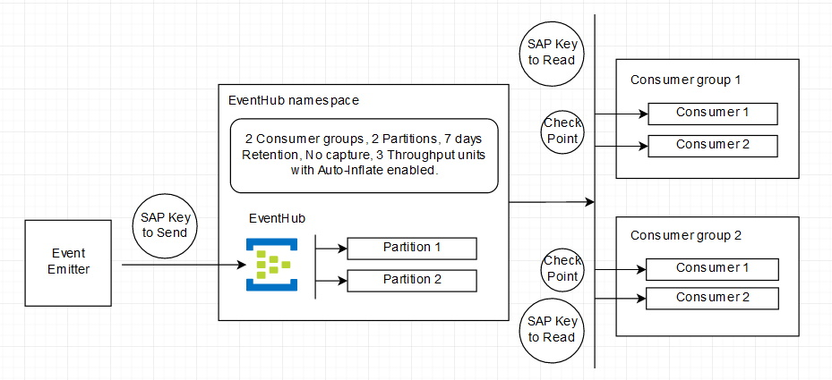

# Azure-Sample-EventHub
The idea is to emit custom events to an EventHub and receive those events from a consumer group. There are two console projects (SendEvent, ReceiveEvent) in this solution. 

# Todo
1. Explain why do we need a blob storage.
2. Explain the projects.
3. Explain the design.

